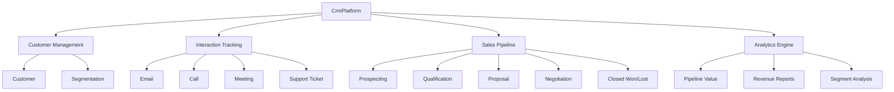

# Java CRM Platform

<div align="center">


</div>


[English](#english) | [Portugues](#portugues)

---

## Portugues

Plataforma de CRM (Customer Relationship Management) em Java com gestao de clientes, rastreamento de interacoes, pipeline de vendas com estagios e analises de desempenho comercial.

### Arquitetura



### Funcionalidades

- Gestao completa de clientes com segmentacao (Enterprise, SMB, Mid-Market)
- Rastreamento de interacoes: email, chamada, reuniao, ticket de suporte
- Pipeline de vendas com estagios e probabilidade ponderada
- Busca de clientes por nome, email ou empresa
- Analises: valor do pipeline, receita fechada, distribuicao por segmento
- Calculo automatico de Lifetime Value (LTV) do cliente

### Como Executar

```bash
mvn compile
mvn exec:java -Dexec.mainClass="com.galafis.crm.CrmPlatform"
```

---

## English

CRM (Customer Relationship Management) platform in Java with customer management, interaction tracking, sales pipeline with stages, and commercial performance analytics.

### Architecture


### Features

- Full customer management with segmentation (Enterprise, SMB, Mid-Market)
- Interaction tracking: email, call, meeting, support ticket
- Sales pipeline with stages and weighted probability
- Customer search by name, email, or company
- Analytics: pipeline value, closed revenue, segment distribution
- Automatic customer Lifetime Value (LTV) calculation

### How to Run

```bash
mvn compile
mvn exec:java -Dexec.mainClass="com.galafis.crm.CrmPlatform"
```

## Author

Gabriel Demetrios Lafis

## License

MIT License
